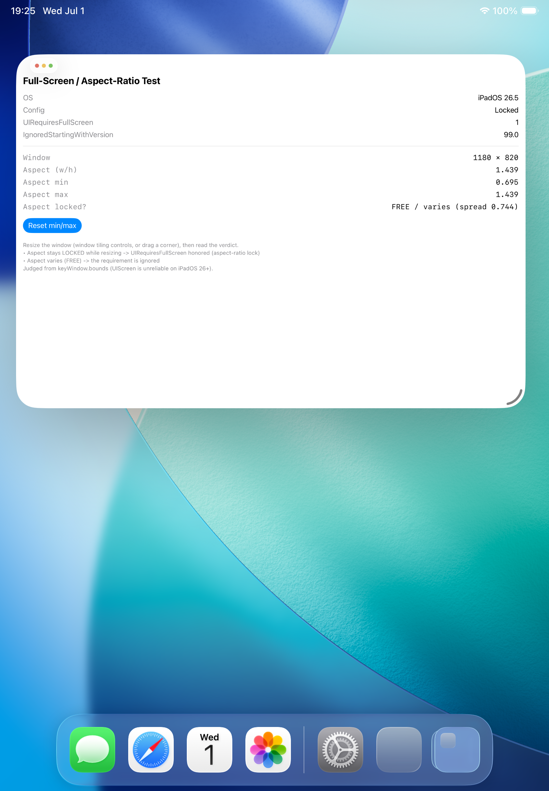
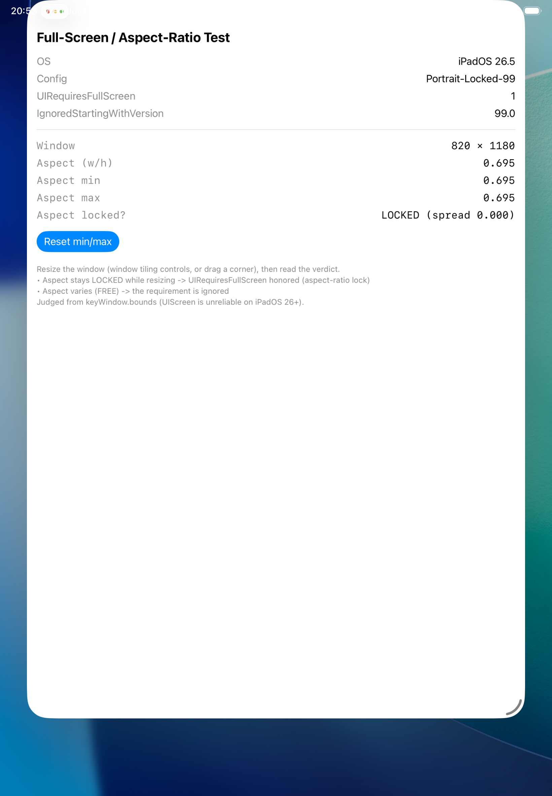
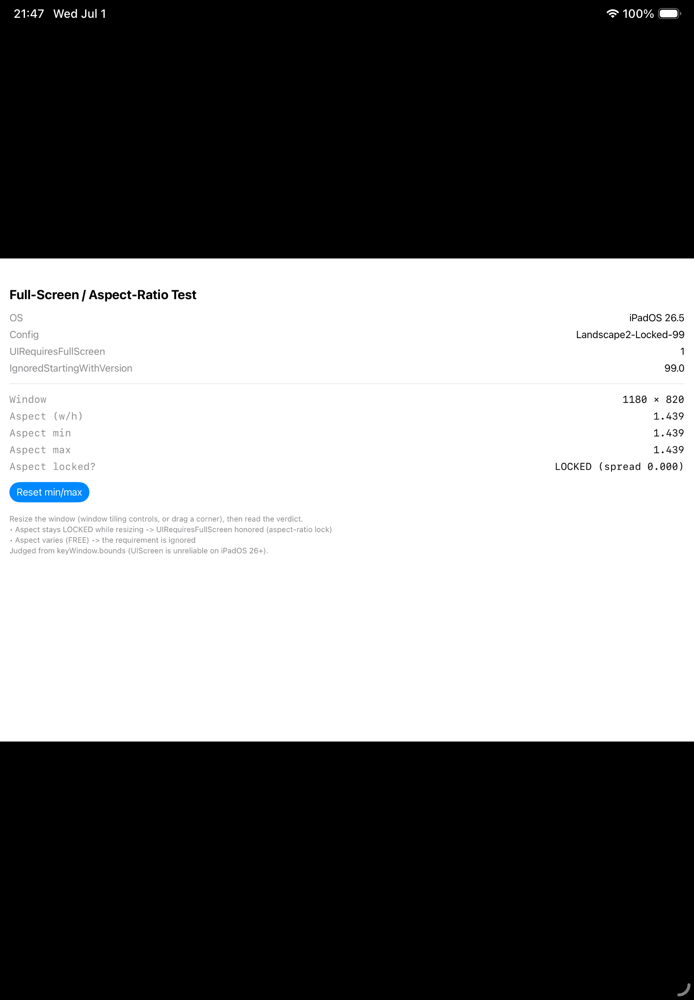

# TestFullScreen

A minimal iPad app for investigating how the `Info.plist` keys **`UIRequiresFullScreen`** and
**`UIRequiresFullScreenIgnoredStartingWithVersion`** actually behave on iPadOS 26.5 / 27.0.

Full write-up (for Feedback Assistant): **[FEEDBACK_REPORT.md](FEEDBACK_REPORT.md)**.

## Conclusion (short)
- **`UIRequiresFullScreenIgnoredStartingWithVersion` has no observable effect** — thresholds `26.0` / `27.0` / `99.0` all behave identically for a given OS + orientation, and the documented "honor below the threshold, ignore at/above" contract is not met on either OS.
- **`UIRequiresFullScreen`'s residual effect is an aspect-ratio / letterbox lock tied to the app's declared orientations, honored only on iPadOS 26.x:**
  - restricted-orientation app (e.g. Portrait- or Landscape-only) → keeps its aspect ratio (letterboxed); can't take an arbitrary shape.
  - all-orientations app → resizes freely (no lock).
  - **iPadOS 27.0 ignores the requirement entirely** — even a Portrait-only app resizes wider-than-tall.

| OS | Orientations | Threshold | Result |
|---|---|---|---|
| 26.5 | all | 99.0 / 26.0 | free resize (aspect FREE) |
| 26.5 | Portrait only | 99.0 / 26.0 | full-screen locked |
| 26.5 | Landscape ×2 | 99.0 | keeps landscape aspect, **letterboxed** |
| 27.0 | all / Portrait | 27.0 / 99.0 / false | free resize (ignored) |

## Test harness
- Two build configurations, **`Locked`** and **`Ignored`**, differing only by the `FULLSCREEN_IGNORE_VERSION` build setting (`99.0` vs `27.0`), injected into `Info.plist` (`UIRequiresFullScreenIgnoredStartingWithVersion = $(FULLSCREEN_IGNORE_VERSION)`). Switch via the matching schemes.
- [`Info.plist`](Info.plist) is a manual plist (`GENERATE_INFOPLIST_FILE = NO`) so the two keys and `ConfigurationName = $(CONFIGURATION)` can be set explicitly.
- [`TestFullScreen/ContentView.swift`](TestFullScreen/ContentView.swift) is a diagnostic view: it reads the two keys back and tracks the min/max window aspect ratio (`keyWindow.bounds`) so you can see whether the aspect ratio stays **LOCKED** or goes **FREE** while resizing.
- Other threshold / orientation variants were produced by PlistBuddy-patching the built `.app` (no project-file edits).

## How to reproduce
1. Build the `Locked` or `Ignored` scheme and run on an **iPad simulator in "Windowed Apps" mode** (Settings → Multitasking).
2. Tap **Reset min/max**, then drag the window's resize handle to 2–3 different shapes.
3. Read **"Aspect locked?"**: `LOCKED (spread ≈ 0)` = honored; `FREE / varies` = ignored.

## Screenshots
iPadOS 26.5 — all orientations resize freely, but a restricted-orientation app keeps its aspect ratio:

Left→right: all-orientations (aspect FREE) · Portrait-only (full-screen locked) · Landscape-only (aspect kept, **letterboxed**). See [`screenshots/`](screenshots/) for the full set.
